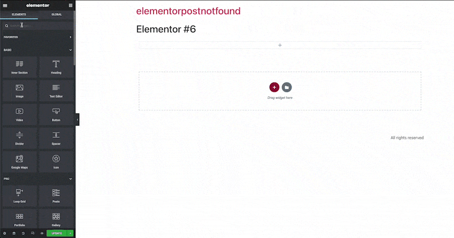

    
    
    
    
    

 

<h1 align="center">Post Not Found for Elementor Pro</h3>
  

    This plugin solves a single simple ommision in elementor pro. When there are no posts found for an elementor pro's posts widget, we should display something to say just that: there were no posts found.  This plugin adds controls to the elementor page builder that makes it easy to include a saved section or just display some simple text indicating no posts were found. 
     
    <a href="https://github.com/johnkraczek/post-not-found-for-elementor"><strong>Explore the docs »</strong></a>
     
     
    <a href="https://github.com/johnkraczek/post-not-found-for-elementor/issues">Report Bug</a>
    ·
    <a href="https://github.com/johnkraczek/post-not-found-for-elementor/issues">Request Feature</a>
  

<!-- ABOUT THE PROJECT -->

## About The Project

I used this issue to show how I build simple wordpress plugins. If you are interested in watching me build this from scratch check out the youtube video here:

<!-- GETTING STARTED -->

## Getting Started

Just like any wordpress plugin, if installing from this repo, download the zip file & upload to the wordpress admin dashboard.

### Prerequisites

This plugin requires the paid Elementor Pro subscription to be of any use

<!-- USAGE EXAMPLES -->

## Usage

Open the elementor page builder and insert a post widget.
Then in the content tab, under query toggle the show not found content.

Use the drop down to choose if you would prefer to show a simple text message or a saved elementor section.
(you will need to save the section prior to using it here.)  

        

(<a href="#readme-top">back to top</a>)

<!-- CONTRIBUTING -->

## Contributing

Contributions are what make the open source community such an amazing place to learn, inspire, and create. Any contributions you make are **greatly appreciated**.

If you have a suggestion that would make this better, please fork the repo and create a pull request. You can also simply open an issue with the tag "enhancement".
Don't forget to give the project a star! Thanks again!

1. Fork the Project
2. Create your Feature Branch (`git checkout -b feature/AmazingFeature`)
3. Commit your Changes (`git commit -m 'Add some AmazingFeature'`)
4. Push to the Branch (`git push origin feature/AmazingFeature`)
5. Open a Pull Request

(<a href="#readme-top">back to top</a>)

<!-- LICENSE -->

## License

Distributed under the GPL v2 or later. See `LICENSE.txt` for more information.

(<a href="#readme-top">back to top</a>)

<!-- CONTACT -->

## Contact

John Kraczek - [@johnkraczek](https://twitter.com/@johnkraczek)

Project Link: [https://github.com/johnkraczek/post-not-found-for-elementor](https://github.com/johnkraczek/post-not-found-for-elementor)

(<a href="#readme-top">back to top</a>)

